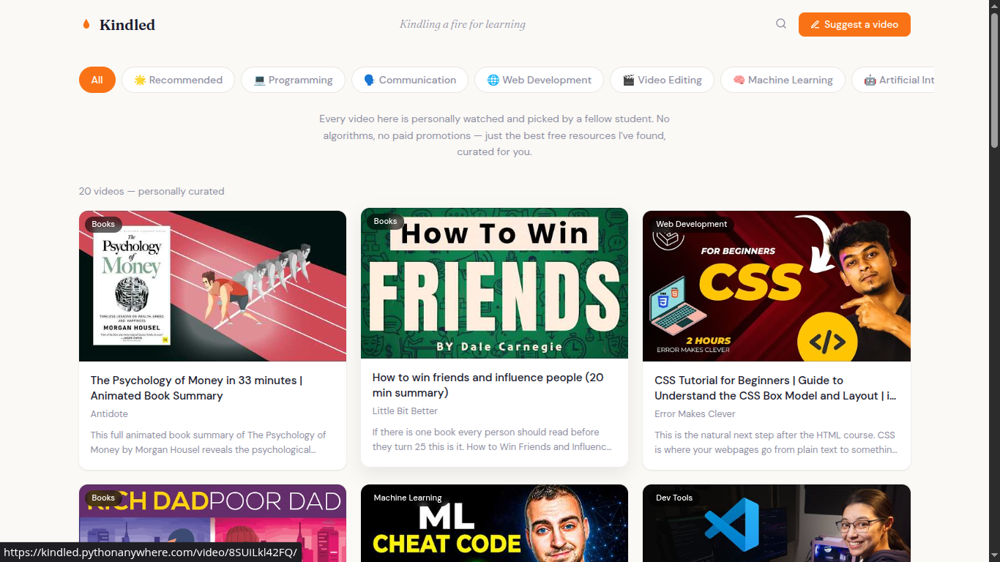

<div align="center">
  <h1>🔥 Kindled</h1>
  <p><strong>Kindling a fire to learn</strong></p>
  <p>Curated video learning platform for college students</p>
  <p>
    <a href="https://kindled.pythonanywhere.com" target="_blank">
      <strong>🌐 Visit the site →</strong>
    </a>
  </p>
  <p>
    
    
    
  </p>
</div>

---

## 📖 The Story

YouTube is hands down the greatest place to learn. Whatever you want to study — programming, math, physics, design — the best teachers in the world are uploading for free. But there's a problem.

**Finding the right video is exhausting.**

You search, you scroll, you wade through clickbait, 10-minute intros, and tutorials that teach you nothing. Most engineering students don't even know which channels to follow or where to start. I've seen my college mates spend hours looking for a good resource and either give up or settle for something mediocre.

I wanted to fix that.

So I started collecting. Every video on Kindled is one I've personally watched and thought — *"This. This is the one."* No algorithm deciding what you see. No infinite feed. Just a growing library of the best educational content I could find, organized by topic, with a note on why each one matters.

No fluff. No noise. Just the good stuff.

This site was born because I wanted a place where my college mates — and anyone else — could come and actually *find* the resources they need without wasting time. Kindled is my way of sharing what I've found with everyone else.

---

## ✨ Features

- **Hand-picked videos** — every single video is personally watched and curated
- **Category filters** — browse by topic with pill-style navigation
- **🌟 Recommended section** — the must-watch picks with a dedicated filter and badge
- **Distraction-free embeds** — no related videos, no recommendations, just the lesson
- **Curator notes** — each video comes with a note explaining why it's worth your time
- **Suggest a video** — found something great? Drop a link and I'll check it out
- **Fully responsive** — works on mobile and desktop

---

## 🛠️ Tech Stack

| Layer      | Technology                    |
| ---------- | ----------------------------- |
| Backend    | Django 6.0.5 + SQLite         |
| Frontend   | HTML, CSS, vanilla JavaScript |
| Language   | Python 3.12.3                 |
| Deployment | PythonAnywhere                |

---

## 📍 The Process

I've been on a mission to build something useful for the people around me. Most learning platforms either trap you in a subscription or drown you in options. I wanted the opposite — something simple, intentional, and actually helpful.

Started with Django because it's rock solid for this kind of thing. Built the models, wired up the views, designed the templates. Every thumbnail, every filter pill, every badge — all vanilla. No frameworks, no bloat.

The result is a site that loads fast, looks clean, and does exactly one thing well: **help you find a great video to watch.**

Sure, it's not the most complex thing in the world. But 1,500+ visits later, I know it's helping people. And that's the whole point.

---

## 📸 Preview



---

## 🚀 Running Locally

```bash
python manage.py runserver
```

---

<p align="center">
  Built with care by <strong>Raj G.</strong>
</p>
